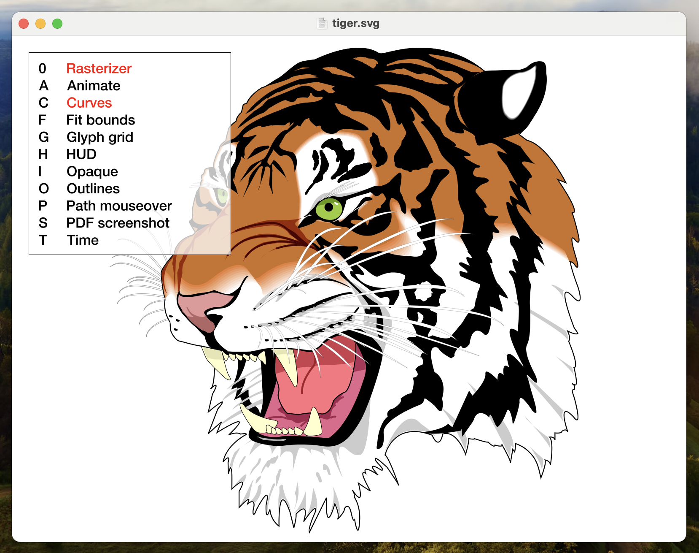

Rasterizer
==========

**A GPU vector graphics renderer for Apple platforms, 2–7× faster than Vello and Skia on real-world documents.**

  

Rasterizer turns vector paths into reference-quality anti-aliased pixels with Metal. It draws maps, engineering drawings and illustrations with hundreds of thousands of paths at interactive frame rates, and loads SVG and PDF files directly.

<!-- TODO: replace with a GIF of a large document, e.g. Paris 30K or the London rail map, being zoomed in the iOS app -->



Performance
-----------

Wall time per frame in milliseconds, fitting each file to a 2048×2048 view on an M4 Max. Lower is better.

| File | Draws | Rasterizer | Vello | Skia Graphite | Skia Ganesh |
|---|---:|---:|---:|---:|---:|
| tiger | 301 | 1.02 | 0.81 | 0.43 | 1.45 |
| london-rail | 10,645 | **0.98** | 2.62 | 7.36 | 8.01 |
| Paris 30K | 50,791 | **1.99** | 12.10 | 30.18 | 56.48 |
| spoorkaart | 84,239 | **3.87** | 21.84 | 57.60 | 238.09 |
| 6000-DRG | 410,998 | **13.32** | 84.08 | 191.90 | 197.48 |
| pathological | 579,735 | **9.40** | 56.21 | 226.67 | 301.06 |

Across all 15 test files, Vello takes 2.3× as long as Rasterizer, Skia Graphite 4.7× and Skia Ganesh 6.7× (geometric means). Small scenes, under about 1,000 draws, are within noise. The advantage grows with the number of paths.

The benchmark is a single self-contained script that builds every library and replays the same geometry in each. See [Benchmarks](Benchmarks/README.md) for the method, all the results and the caveats.


Features
--------

- **Fills** with even-odd and non-zero fill rules, following the PostScript model
- **Strokes** with butt, square or round caps, miter or round joins, and widths in user or device space
- **Dashes**, by making a dashed copy of a path
- **Linear and radial gradients**, and **images**
- **Clipping** to rectangles, or to anti-aliased clip paths with either fill rule
- **Blend modes**: all of Core Graphics' separable and non-separable modes
- **Text** laid out by Core Text
- **SVG import** via NanoSVG
- **PDF import**, with a parallel content-stream parser that spreads each page across all CPU cores
- **Editable scenes**: change a draw's transform, color or width in place, without rebuilding the scene
- **Up to 120Hz** on ProMotion displays
- A CPU reference renderer using **Core Graphics**, for comparison


Quick start
-----------

Rasterizer is a Swift package, with its sources in [`Package/Sources`](Package/Sources), and three libraries:

| Library | What it is |
|---|---|
| `RasterizerCpp` | The C++17 renderer core |
| `RasterizerObjC` | The API used from Swift and Objective-C, and `RasterizerView`, a Metal-backed `UIView` or `NSView` |
| `RasterizerSwift` | Swift helpers, such as fitting a scene to a view |

In Xcode, choose **File ▸ Add Package Dependencies…**, enter `https://github.com/mindbrix/Rasterizer`, and link `RasterizerObjC`, plus `RasterizerSwift` if you want the helpers. Or, in a `Package.swift`:

```swift
dependencies: [
    .package(url: "https://github.com/mindbrix/Rasterizer", branch: "master"),
],
targets: [
    .target(name: "MyApp", dependencies: [
        .product(name: "RasterizerObjC", package: "Rasterizer"),
        .product(name: "RasterizerSwift", package: "Rasterizer"),
    ]),
]
```

There are no release tags yet, so depend on a branch. To work on Rasterizer alongside your app, add your clone with **Add Local…** instead.

A `RasterizerView` asks its delegate each frame whether to redraw, and for the list of scenes to draw:

```swift
import UIKit
import RasterizerObjC

class ViewController: UIViewController, RASceneListDelegate {
    let list = RASceneList()
    var redraw = true

    override func loadView() {
        let view = RasterizerView()
        view.listDelegate = self
        self.view = view
    }

    override func viewDidLoad() {
        super.viewDidLoad()
        let scene = RAScene()
        let orange = RAPaint(red: 1, green: 0.45, blue: 0.1, alpha: 1)
        scene.addFill(RAPath(ellipse: CGRect(x: 40, y: 40, width: 240, height: 240)), ctm: .identity, color: orange, evenOdd: false)
        scene.addStroke(RAPath(rect: CGRect(x: 20, y: 20, width: 280, height: 280)), ctm: .identity,
                        color: RAPaint(gray: 0.1, alpha: 1), width: 8, capStyle: .capRound, joinStyle: .joinRound)
        list.add(scene, ctm: .identity, clip: .zero)
        list.clearColor = RAPaint(gray: 0.95, alpha: 1)
    }

    // RasterizerView asks every frame, & draws when this returns true
    func shouldRedraw(atTime time: Double, scale: Double, width: Double, height: Double) -> Bool {
        redraw
    }

    func getListAtTime(_ time: Double, scale: Double, width: Double, height: Double) -> RASceneList {
        redraw = false
        return list
    }
}
```

On macOS, it's the same code with `NSViewController`.

Load an SVG or a PDF page, and fit it to the view:

```swift
import RasterizerSwift

let scene = RAScene()
let ctm = scene.addSvg(from: svg)   // Or scene.addPdf(from: pdf, pageIndex: 0)
let list = RASceneList()
list.add(scene, ctm: ctm, clip: .zero)
list.ctm = view.bounds.fitTransform(b: list.bounds)     // Fit it to the view
```

Edit draws in place, for example to animate them:

```swift
scene.updateDraws(in: NSRange(location: 0, length: scene.count)) { index, draw in
    draw.color = RAPaint(hue: Double(index) / Double(scene.count), saturation: 0.8, value: 0.9, alpha: 1)
    return true     // Changed, so it's redrawn
}
```

Changing a draw's transform, color or stroke width is cheap. Changing its path, its visibility, or turning a stroke into a fill means the scene is prepared again.


Demo apps
---------

Both build out of the box, as all dependencies are included.

### iOS

Open `RasterizeriOS/RasterizeriOS.xcodeproj`.

- Tap to step through the bundled SVGs and your own files.
- Drag and pinch to pan and zoom.
- The folder button imports SVG and PDF files, which are kept between launches. The trash button removes the one showing.
- PDFs with more than one page get a page stepper.
- The grid button animates every draw into a grid of cells, and back.
- Files can also be sent to the app with **Share** in the Files app.

### macOS

Open `Rasterizer.xcworkspace` and run the **Run Rasterizer** scheme for the best performance, or **Debug Rasterizer** for debugging.

- Open SVG and PDF files, and use the `-` and `+` keys to change PDF page.
- Drag and zoom or rotate with the trackpad or mouse. Hold `Shift` to zoom or rotate around the pointer.
- The HUD, top left, lists the keys. `0` switches between Rasterizer and Core Graphics, `O` shows path outlines, and `T` shows an animated clock built from text.
- Set the font with the fonts panel (`⌘T`).


How it works
------------

`Path` objects follow the PostScript model. `Scene` objects group paths with their draw parameters: color, transform, stroke width, flags, and an optional clip. `SceneList` objects group scenes, each with its own transform and clip, for rendering.

- Filled paths are rasterized in two stages: first to a float mask buffer, then to the color buffer.
- Small screen-space fills, such as glyphs, are the fastest case, as their path geometry can be copied straight into GPU memory.
- Larger fills use a fat scanlines algorithm on clipped, device-space geometry.
- Pixel coverage is calculated with a novel windowed inverse-lerp algorithm.
- Strokes are rasterized straight to the color buffer, using GPU triangulation.
- Quadratic Bézier curves are solved on the GPU, so curve geometry can stay coarse.
- Clip paths are rendered to an anti-aliased coverage mask within the same render pass.
- The CPU stages use simple batch parallelism.

The GPU holds no state. Each frame is written afresh to double-buffered shared memory. In practice, copying is cheaper than managing GPU-resident paths in a parallel context.


Background
----------

Inspired by my love of Adobe Flash, I started work on a GPU-accelerated 2D vector graphics engine for the original iPhone, and then the Mac. Three iterations and many years later, Rasterizer is the result.

The long gestation came from endlessly iterating over one core problem: turning vector paths into reference-quality anti-aliased pixels efficiently. Some of the solutions may extend the state of the art.


Credits
-------

Many thanks to the creators of:

- [NanoSVG](https://github.com/memononen/nanosvg), for SVG parsing
- [xxHash](https://xxhash.com), for hashing


License
-------

Rasterizer is licensed under the [MIT license](LICENSE.txt). NanoSVG and xxHash keep their own licenses.


Tips
----

You can show appreciation for my work [here](https://paypal.me/mindbrix).
